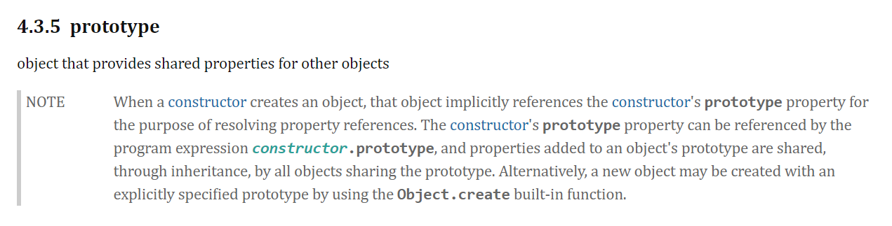

# js汇总
## 一 深入理解原型
### 1.概念  
[ES2019规范](https://www.ecma-international.org/ecma-262/10.0/)对prototype的描述：
  > object that provides shared properties for other objects  



### 2.理解： 
  
prototype本身就是一个普通的js对象   

类似pubsub pattern 发布/订阅模式，发布者publisher与订阅者subscriber，与其他的普通js对象并没有本质的区别，只是一个约定而已

类比生活中的海军和空军，退役后都是普通人  

### 3.相关方法
- [Object.create ](#二Object.create)
- Object.setPrototypeOf
为一个已有的对象指定原型
### 4.参考：  
  [深入理解 JavaScript 原型](https://mp.weixin.qq.com/s/qg9LNm3awHBao1Du5n6KMQ)


## 二 Object.create 
将指定对象设为原型去实例化一个新的对象
### 1.参数
- prototype  原型
- properties  可枚举属性
### 2.实现原理
```js
Object.create = function(prototype, properties) {
  if(!prototype || typeof prototype !== 'object') { 
    throw new Error('prototype must be a object')
  }
  function Constructor() {}
  Constructor.prototype = prototype
  let obj = new Constructor()
  o.constructor = Constructor
  if( properties !== undefined) {
    if(!properties || typeof properties !== 'object') {
      throw new Error('properties must be o object')
    }
    Object.defineProperties(obj, properties)
  }
  return obj
}
```

## 三 hasOwnProperty ??

## 四. Object.defineProperty
### 1. 参数
- obj
- prop
- descriptor
### 2. 描述符--（数据/存取）
- 数据描述符：value,writeble
- 存取描述符：set,get
- 公共选项：configurable, enumerable
> 数据描述符与存取描述符不能混合使用, 默认值均为false或undefined
#### 1. configurable
configurable特性表示对象的属性是否可以被删除，以及除writable和value特性意外的其他特性是否可以修改
#### 2. writable
属性值是否可以修改
#### 3. enumerable
属性是否可以在`for...in`和`Object.keys()`中被枚举到
#### 4. get
#### 5. set(newValue)

## 四. 函数式编程(FP)
### Monad/Monoid ??

## 五、MutationObserve
监听DOM的改变，在指定DOM改变时被调用
- observe      指定dom、监听内容属性
- disconnect   取消监听
- takeRecords  获取变更队列中所有已检测到但尚未处理的记录

```
var targetNode = document.querySelector("#someElement");
var observerOptions = {
  childList: true,
  attributes: true
}

var observer = new MutationObserver(callback);
observer.observe(targetNode, observerOptions);

/* ...later, when it's time to stop observing... */

/* handle any still-pending mutations */

var mutations = observer.takeRecords();

if (mutations) {
  callback(mutations);
}

observer.disconnect();
```
## 六、setImmediate
在其他代码执行完毕会立马执行该回调，用于处理运行时间长的程序
```
var immediateID = setImmediate(func, [param1, param2, ...])
clearImmediate(immediateID)
```

## 七、new 操作符
new操作符一共做了四件事：
- 创建一个空对象
- 给对象指定原型
- 执行构造函数
- 判断构造函数有没有返回值，没有则返回创建的对象

### 1. 实现
```js
function myNew(constructor, ...args) {
  // 创建空对象
  let o = {}
  // 指定原型
  o.__proto__ = constructor.prototype
  let res = constructor.call(o, ...args)
  // 确定返回值，若构造函数的返回值是对象，则将其返回，否则返回新创建的对象o
  return typeof res === 'object' && res !== null ? res : o
}
```

## 八、Array.prototype.slice
返回一个新数组对象，原数组对象不改变。*浅拷贝*
### 1. 参数
- begin  
  起始索引，包含该处元素  
  默认为0
  若参数为负数，表示从倒数第几个开始，slice(-2)表示从倒数第二个开始（包含倒数第一个和倒数第二个）
  若大于数组长度，返回空数组

- end
  终止索引，不包含改处元素
  默认结束为止
  若参数为负数，表示到倒数第几个结束，slice(-2, -1)表示倒数第二个到倒数第一个（只包含倒数第二个，不包含倒数第一个）

