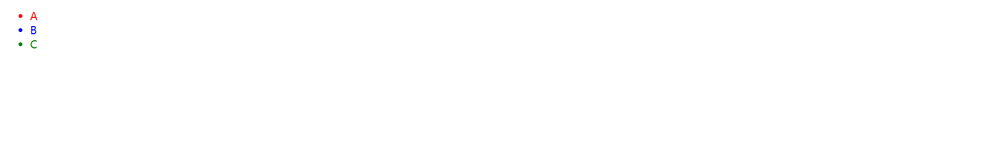

# 实现一个简单的Vue
包含三个功能：
- 实现`h`函数，创建虚拟DOM
- 实现`mount`函数，将虚拟DOM转化为真实DOM，并挂载到指定容器
- 实现`patch`函数，更新DOM，模拟domDiff算法，组件复用，更新子节
  
涉及概念：
- 虚拟DOM：就是一个普通的JS对象，存放着属性、类型、children，作用是描述真实DOM，存放真实DOM信息
- 更新视图：通过vNode创建一个真实DOM，插入到文档中，当state改变时，会根据新的state创建一个新的vNode，与原来的vNode进行比较，根据差异修改DOM,从而实现视图更新

## 一、一个简单的例子
用Vue动态创建一个列表，并插入到文档中，只需要三步：
- 获取根节点
- 创建虚拟dom
- 将虚拟dom挂载到根节点上  
  
代码如下：

```js
// index.js
import {h, mount} from './vdom'

// 一、获取根节点
const root = document.getElementById('root')

// 二、创建虚拟dom
const vnode = h(
  'ul', // type
  // 特性
  {
    id: 'container',
    style: {width: '200px'}
  },
  // 子节点
  h('li', {style: {color: 'red'}}, 'A'),
  h('li', {style: {color: 'blue'}}, 'B'),
  h('li', {style: {color: 'green'}}, 'C'),
)

// 三、将虚拟节点挂载到根节点上
mount(vnode, root)
```
浏览器渲染效果如下：



## 二、实现虚拟DOM的创建
上述例子一共用到两个方法，`h`函数和`mount`函数

### 1. h函数的实现
- 拷贝属性
- 生成vnode
```js
import vnode from './vnode'

export default function h(type, config, ...children) {
  // 存放属性
  const props = {}
  let key
  if(config && config.key) {
    key = config.key
  }
  // 遍历config中的属性,拷贝到props中
  for(let propName in config) {
    if(config.hasOwnProperty(propName) && propName !== 'key') {
      props[propName] = config[propName]
    }
  }
  // 生成虚拟节点
  // 其实就是按照约定的属性名重新拼装了一个对象，额外插入一个_type属性 标明是虚拟节点
  return vnode(type, key, props, children.map((child, index) => {
    // 判断child为 字符串或数字， 创建文本节点
    return typeof child === 'string' || typeof child === 'number' ? vnode(
      undefined, undefined, undefined, undefined, child
    ) : child
  }))
}
```
`vnode`方法是如何创建一个虚拟节点的？
- 根据约定的属性名格式化一个js对象
- 添加`_type`属性，标识该对象是虚拟节点
```js
// vnode.js
export default function vnode(type, key, props={}, children=[], text, domElement) {
  return {
    _type: VNODE_TYPE,
    type, key, props, children, text, domElement
  }
}

```

## 三. 实现虚拟DOM与真实DOM的转换
`mount`函数包含两个步骤：  

1. 通过`虚拟`DOM生成`真实`DOM
2. 将DOM挂载到容器上
```js
/**
 *将虚拟节点转换为真实节点 挂载到容器上
 * @param {*} vnode 
 * @param {*} container 
 */
export function mount(vnode, container) {
  let domElement = createDOMElementFromVnode(vnode)
  container.appendChild(domElement)
}
```

将创建真实DOM的过程封装成了`createDOMElementFromVnode`方法
- 根据type属性创建一个element
- 给element属性进行赋值
- 递归创建children
```js
function createDOMElementFromVnode(vnode) {
  let { type, children } = vnode
  if(type) {
    // 创建真实节点 并挂载到vnode的domElement上
    let domElement = vnode.domElement = document.createElement(type)
    // 属性赋值
    updateProperties(vnode)
    // 递归遍历子节点 并操作dom 将子节点插入到当前节点下
    if(Array.isArray(children)) {
      children.forEach(child => {
        domElement.appendChild(createDOMElementFromVnode(child))
      })
    }
  } else{
    // 创建文本节点
    vnode.domElement = document.createTextNode(vnode.text)
  }
  return vnode.domElement
}
```
更新DOM属性
- 用新属性与旧属性进行比较，删除多余的旧属性
- 用新属性的值覆盖原来的值，实现`增`和`改`
- 注：这里修改的对象都是文档上的真实dom,现代浏览器已经对DOM操作做了优化，不需要额外处理
```js
/**
 * 直接操作DOM，更新属性
 * @param {*} vnode 
 * @param {*} oldProps 
 */
function updateProperties(vnode, oldProps={}) {
  let newProps = vnode.props
  let domElement = vnode.domElement

  // 对style等特殊属性进行单独处理
  let oldStyle = oldProps.style || {}
  let newStyle = newProps.style || {}

  // 属性更新：删除不需要的属性，然后用新属性覆盖老属性
  
  // 删除style多余属性
  for(let oldAttrName in oldStyle) {
    if(!newStyle[oldAttrName]) {
      domElement.style[oldAttrName] = ''
    }
  }
  // 清除多余属性
  for(let oldPropName in oldProps) {
    if(!newProps[oldProps]) {
      delete domElement[oldPropName]
    }
  }

  // 用新属性覆盖旧属性
  for(let newPropName in newProps) {
    if(newPropName === 'style') {
      let styleObject = newProps.style
        for (let newAttrName in styleObject) {
            domElement.style[newAttrName] = styleObject[newAttrName]
        }
    } else {
      domElement[newPropName] = newProps[newPropName]
    }
  }
}
```
## 四、实现带有组件复用功能的视图更新
- 判断更新的节点与原节点类型是否相同，若相同则复用原来的节点，然后根据差异打补丁；若不相同，直接创建新节点替代原来的节点
- 如果该节点下存在children，根据`type`和`key`判断该child是否需要复用
- 考虑到子节点列表可能存在顺序发生变化，所以需要一定的算法去优化，尽可能的实现组件复用提高性能
  - 头对头：顺序不改变的情况，新旧队列按顺序对比
  - 头对尾：顺序翻转的情况，新队列从头开始，旧队列从尾开始
  - 尾对头：旧队列从头开始，新队列从尾开始
  - 尾对尾：队列靠前的元素被删除的情况，新旧队列都从尾部开始比较
  - 依次遍历，再以上四种情况都没有匹配的情况下，用新队列当前元素与旧队列所有元素比较

```js
export function patch(oldVnode, newVnode) {
  // 判断节点类型是否相同 如果不相同 直接删除重建
  if(oldVnode.type !== newVnode.type) {
    return oldVnode.domElement.parentNode.replaceChild(createDOMElementFromVnode(newVnode), oldVnode.domElement)
  }
  // 文本节点 直接替换内容
  if(newVnode.text !== undefined) {
    return oldVnode.domElement.textContent = newVnode.text
  }

  // 如果节点类型相同，则更新该节点真实DOM属性
  let domElement = newVnode.domElement = oldVnode.domElement
  updateProperties(newVnode, oldVnode.props)

  // 更新children
  let oldChildren = oldVnode.children
  let newChildren = newVnode.children
  if(oldChildren.length > 0 && newChildren.length > 0) {
    updateChildren(domElement, oldChildren, newChildren)
  } else if(oldChildren.legnth > 0) {
    // 新节点没有children，直接情况dom的子节点
    domElement.innerHTML = ''
  } else if( newChildren.length > 0) {
    // 旧节点没有children，新节点有children，则直接在dom上插入子节点
    for(let i = 0; i < newChildren.length; i++) {
      domElement.appendChild(createDOMElementFromVnode(newChildren[i]))
    }
  }

}
```
更新子节点的算法
```js
function updateChildren(parentDomElement, oldChildren, newChildren) {
  console.log(parentDomElement, oldChildren, newChildren)
  // 创建开始和结束索引及节点
  let oldStartIndex = 0, oldStartVnode = oldChildren[0]
  let newStartIndex = 0, newStartVnode = newChildren[0]
  let oldEndIndex = oldChildren.length - 1, oldEndVnode = oldChildren[oldEndIndex]
  let newEndIndex = newChildren.length - 1, newEndVnode = newChildren[newEndIndex]
  let oldKeyToIndexMap = createKeyToIndexMap(oldChildren)

  // 两个队列如果有一个结束则循环结束
  while (oldStartIndex <= oldEndIndex && newStartIndex <= newEndIndex) {
    // 老队列开始节点与新队列开始节点比较
    if (!oldStartVnode) {
      oldStartVnode = oldChildren[++oldStartIndex]
    } else if (!oldEndVnode) {
      oldEndVnode = oldChildren[--oldEndIndex]
    } else if (isSameNode(oldStartVnode, newStartVnode)) {
      // 头对头--两个队列的开始节点为同一节点
      patch(oldStartVnode, newStartVnode)
      // 索引向后移动
      oldStartVnode = oldChildren[++oldStartIndex]
      newStartVnode = newChildren[++newStartIndex]
    } else if (isSameNode(oldEndVnode, newEndVnode)) {
      // 尾对尾--两队列结束节点为同一节点
      // 为'在队列的开始插入新子节点'的情况做优化
      patch(oldEndVnode, newEndVnode)
      // 结束索引向前移动
      oldEndVnode = oldChildren[--oldEndIndex]
      newEndVnode = newChildren[--newEndIndex]
    } else if (isSameNode(oldEndVnode, newStartIndex)) {
      // 头对尾--新队列开始节点与老队列结束节点为相同节点
      patch(oldEndVnode, newStartIndex)
      oldEndVnode = oldChildren[--oldEndIndex]
      newStartVnode = newChildren[++newStartIndex]
    } else if (isSameNode(oldStartVnode, newEndVnode)) {
      // 尾对头
      patch(oldStartVnode, newEndVnode)
      oldStartVnode = oldChildren[++oldStartIndex]
      newEndVnode = newChildren[--newEndIndex]
    } else {
      // 常见情况都被排除后 遍历老队列中有没有与新队列开始节点key值相同的
      let oldIndexBykey = oldKeyToIndexMap[newStartVnode.key]
      // 如果老队列中没有与新队列开始元素key相同的节点 插入新节点
      if (oldIndexBykey == null) {
        parentDomElement.insertBefore(createDOMElementFromVnode(newStartVnode), oldStartVnode.domElement)
      } else {
        let oldVnodeToMove = oldChildren[oldIndexBykey]
        // 判断节点类型是否相同，相同则复用（移动位置并更新属性），不相同直接插入新的删除旧的（不是替换，位置不相同）
        if (oldVnodeToMove.type !== newStartVnode.type) {
          parentDomElement.insertBefore(newStartVnode, oldStartVnode.domElement)
        } else {
          patch(oldVnode, newStartVnode)
          oldChildren[oldIndexBykey] = undefined
          parentDomElement.insertBefore(newStartVnode, oldStartVnode.domElement)
        }
      }
      // 新队列开始索引向后移动
      newStartVnode = newChildren[++newStartIndex]
    }
  }

  // 如果旧队列先处理完，新队列还没处理完--将新队列剩余节点插入父节点
  if (newStartIndex <= newEndIndex) {
    // 判断节点插入的位置：1）如果通过“尾对尾”处理过新队列后面的节点，则直接插到该节点之前
    let beforeDOMElement = newChildren[newEndIndex + 1] == null ? null : newChildren[newEndIndex + 1].domElement
    for (let i = 0; i <= newEndIndex; i++) {
      parentDomElement.insertBefore(createDOMElementFromVnode(newChildren[i]), beforeDOMElement)
    }
  }

  // 如果新队列先处理完，将旧队列剩余节点删除
  if (oldStartIndex <= oldEndIndex) {
    for (let i = 0; i <= oldEndIndex; i++) {
      parentDomElement.removeChild(oldChildren[i].domElement)
    }
  }
}
```
## 源代码
[源码地址]()
文章写的比较杂乱，可以把源码down下拉，对着源码看可能会好一些

运行代码：
- npm install
- npm run dev